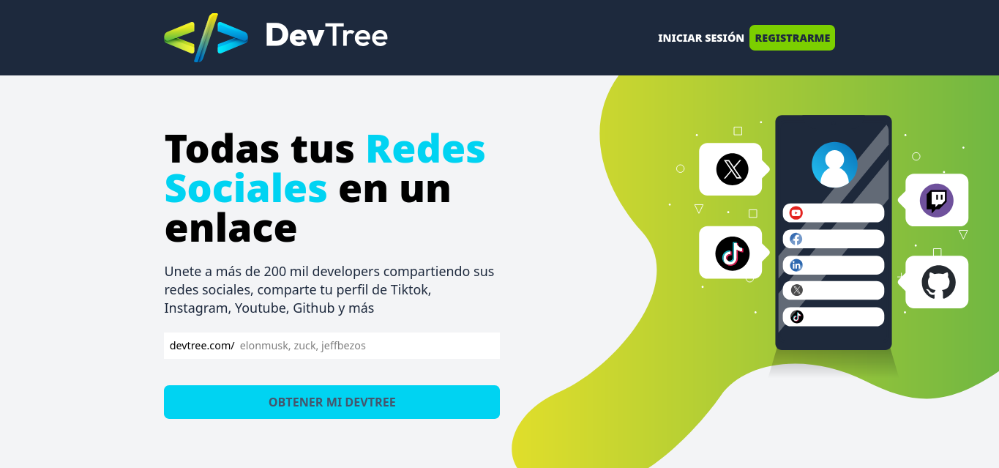

# Proyecto Devtree



## Indice
- [Descripción](#descripción-del-proyecto)
- [Funcionalidades](#funcionalidades-del-proyecto)
- [Tecnologías](#tecnologías-utilizadas)
- [Acceso al proyecto](#acceso-al-proyecto)

## Descripción del proyecto
Devtree es una aplicación web frontend que permite crear una página personal de enlaces estilo "Linktree" completamente personalizable. Los usuarios pueden organizar y compartir sus enlaces importantes en un solo lugar con una interfaz moderna y adaptable.

## Funcionalidades del proyecto
- Avatar de usuario y configuración de nombre
- Descripción personalizable para tu biografía
- Arrastrar y soltar para reorganizar enlaces
- Formulario optimizado para añadir nuevos enlaces
- Validación en tiempo real de URLs
- Categorización flexible de contenido
- URLs amigables (slugs) generadas automáticamente
- Sistema de autenticación completo
- Persistencia de preferencias en localStorage
- Actualizaciones en tiempo real sin recargar página
- Diseño completamente responsive (móvil, tablet, escritorio)

## Tecnologías Utilizadas
- React 
- Typescript
- Vite
- Axios
- Tailwind CSS
- Tanstack Query
- Sonner (para notificaciones)
- React Router DOM (para navegación cliente-side)
- React Hook Form
- React Slugify (para URLs amigables)
- Headless UI (para componentes accesibles)

## Acceso al proyecto
- Demo en Vivo: https://devtreee.netlify.app/
- Repositorio del Backend: https://github.com/dvcode01/Devtree_backend

Para poder hacer uso del proyecto de forma local, sigue las siguientes instrucciones:

```bash
# Clonar repositorio
git clone https://github.com/dvcode01/Devtree_frontend.git

# Instalar dependencias
npm install

# Iniciar entorno de desarrollo
npm run dev
```
